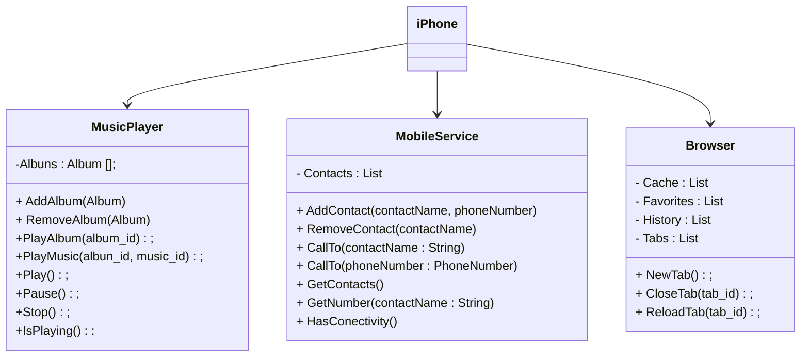

### Diagrama UML (Mermaid)

```mermaid
classDiagram
    class MusicPlayer {
        -Albuns : Album [];
        + AddAlbum(Album)
        + RemoveAlbum(Album)
        +PlayAlbum(album_id);
        +PlayMusic(albun_id, music_id);
        +Play();
        +Pause();
        +Stop();
        +IsPlaying() : 
    }

    class MobileService {
	    - Contacts : List<String, PhoneNumber>
	    + AddContact(contactName, phoneNumber)
	    + RemoveContact(contactName)
	    + CallTo(contactName : String)
	    + CallTo(phoneNumber : PhoneNumber)
	    + GetContacts()
	    + GetNumber(contactName : String)
	    + HasConectivity()
    }

    class Browser {
	    - Cache : List <String, Object>
	    - Favorites : List <String, String>
	    - History : List <Date, String>
	    - Tabs : List <Tab>
	    + NewTab();
	    + CloseTab(tab_id);
	    + ReloadTab(tab_id);
    }

    class iPhone {
    }

    iPhone --> MusicPlayer
    iPhone --> MobileService
    iPhone --> Browser
```
